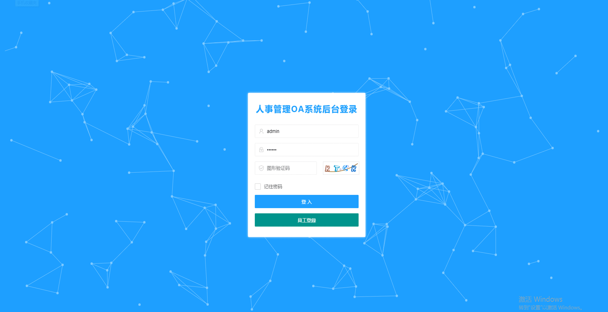
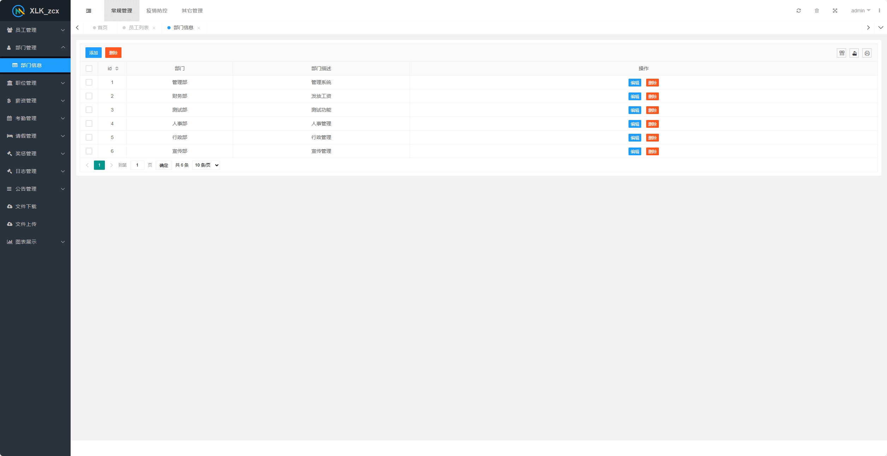
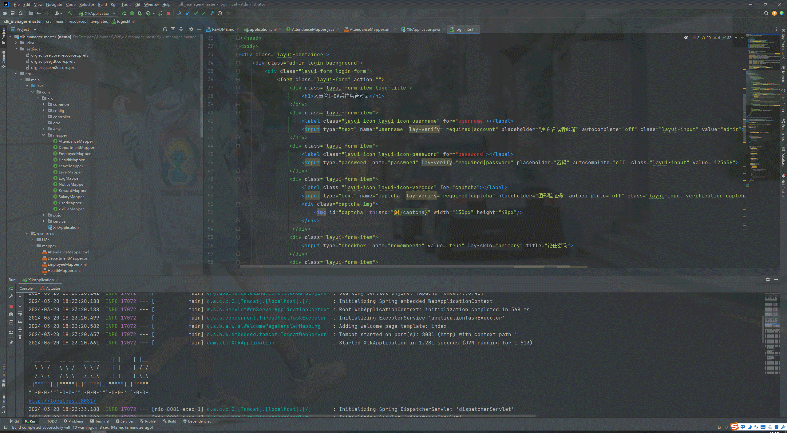

# 基于SpringBoot+LayUi的人事管理OA系统

#### 介绍
人事管理OA系统完结
有BUG可留言加微

#### 软件架构
SpringBoot+LayUi

#### 使用说明
 **数据库文件请使用项目目录下doc文件夹中的sql文件** 

采用IntelliJ IDEA 开发工具和Spring Boot及 MyBatis 等技术来搭建一个人事管理OA系统，具体内容如下:
1.	员工管理：管理员可以对员工进行信息修改，添加员工与修改密码等操作员工只能看到各部门员工的信息。
2.	部门管理：管理员可以对部门的信息等进行修改，员工只可查看有哪些部门。
3.	级别管理：管理员可以对级别进行基本的信息增删改查，员工只可查看。
4.	文件上传：文件上传，上传自己的文件提交到服务器上
5.	文件下载：文件下载，主管可以下载你的文件到自己的本地电脑上
6.	薪资管理：管理员可以对所有人的薪资进行修改与添加，员工只能查看自己的薪资情况。
7.	请假管理：管理员可以对员工申请的请假进行审批。员工可以提交请假申请。
8.	奖惩管理：管理员可以对员工进行奖励与惩罚。员工可以查看自己的奖惩。
9.	公告管理：发布公告。
10.     疫情管理：上传当日温度和行程码 健康码。（可修改）

### 演示截图
#### 登录&主界面

#### 员工界面

#### 部门&职位界面

#### 薪资&考勤界面

#### 请假&奖惩界面

#### 公告&文件上传下载&图表&打卡界面

#### 代码&数据库概览

### 环境需求
- idea/eclipse、jdk-1.8、maven-3.8.6、mysql

### 项目支持
- 项目的发展，离不开大家得支持~！~
- 也可以请作者喝一杯咖啡:)

## 有项目修改、安装调试需求 请联系微信

## 其他项目定制加微☝☝☝

